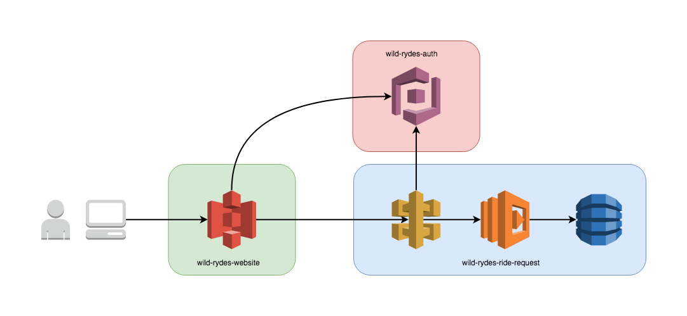

# Serverless New Developer Workshop

Welcome to the Wild Rydes team!  We’re excited you’ve joined our startup that sees past the fad of autonomous vehicle technology the emerging field of mythical winged creature creation and it’s disruptive effect on consumer transportation.


We have funding that has helped us to secure a small fleet of mythical winged creatures.  We have built an MVP technical platform on AWS using serverless architecture for launch.  (These unicorns cost a lot and serverless provides us a cheaper alternative to virtualisation, eg. EC2.)  It’s now time for us to prove that our product and business model works.  We need to scale the Wild Rydes platform.

Today as a new developer on the team we’ll walk you through our development workflow. We’re also going to be launching a new feature!

## About The Wild Rydes Tech Stack
Wild Rydes is built using an AWS serverless nanoservices architecture.  The language of choice for our services is Python.  Our stack uses the following AWS services:

* [S3](https://aws.amazon.com/s3/)
  * Wild Rydes front end.
  * Hosts static web resources including HTML, CSS, JavaScript, and image files.
  * Makes calls to backend to dispatch rides.
* [Cognito](https://aws.amazon.com/cognito/)
  * Handles user management and authenticates access to backend API.
* [API Gateway](https://aws.amazon.com/api-gateway/)
  * Provides backend interface.
  * Each backend endpoint invokes a Lambda.
* [Lambda](https://aws.amazon.com/lambda/)
  * Serverless compute layer.
  * Responsible for managing the ride fleet.
* [DynamoDB](https://aws.amazon.com/dynamodb/)
  * Handles data persistence.
  * Records rides.


Our tech stack is as follows.

* [wild-rydes-website](https://github.com/ServerlessOpsIO/wild-rydes-website)
  * Front end website
* [wild-rydes-auth](https://github.com/ServerlessOpsIO/wild-rydes-auth)
  * Authentication and authorization service
* [wild-rydes-ride-request](https://github.com/ServerlessOpsIO/wild-rydes-ride-request)
  * Ride request backend



<!-- Don't need this.
### AWS environment
Our cloud environment consists of three AWS accounts.  This allows us to segregate environments and limit the blast radius caused by mistakes.

They are:
* __prime:__ Where user access to the environment is managed.
* __prod:__ The production version of our platform used by our users.
* __dev__: This is where the development version of our application resides along with individual developer instances of services.  The development environment should nearly resemble prod as the time between deploying to development and production should be minimal.  Changes laying around undeployed to prod aren’t doing users any good.
-->

## Getting Started
To prepare for this workshop, chooses from one of the options below for setting up your development environment.

* Docker Based Setup (Recommended)
* Manual Setup

### Docker Based Setup (Recommended)

#### 1. Download and Install Docker.

Download and install Docker CE from the following site if you do not already currently have it.

* https://docs.docker.com/install/

#### 2. Pull workshop container image.

Execute the following command to pull the workshop container which has a fully configured environment.

```
docker pull serverlessops/training:latest
```

#### 3. Start And Configure Container.

To start the container, run the following command

```
docker run -ti --rm serverlessops/training:latest
```

After you've started the container you'll be asked to fill in some workshop setup information.  Enter a username for the stage name, along with your AWS access and secret keys.  (If you're doing this as a part of a class you will have been provided these.)

```
Stage name: user0
AWS Access Key ID [None]: |ACCESS_KEY_ID|
AWS Secret Access Key [None]: |SECRET_ACCESS_KEY|
Default region name [us-east-1]:
Default output format [json]:
```

Run the following command and ensure you get back a similar response as below.  This indicates your credentials are properly configured.

```
$ aws sts get-caller-identity
{
    "UserId": "AROAI4AIGYLQKD6SGBBIE:botocore-session-1526934883",
    "Account": "144121712529",
    "Arn": "arn:aws:sts::144121712529:assumed-role/OrganizationAccountAccessUserRole/botocore-session-1526934883"
}
```

#### 4. Working In The Container

After configuration has been completed you will be placed in the `/workshop` directory inside the container.  All tools needed to complete the workshop are configured and provided.  Two editors are available for you to view and edit files.

* nano
* vim

You're now ready to start the workshop!

### Manual Setup
This section covers manually setting up your development environment.  This should only be used if installing Docker is not possible or to understand configuring your own development environment for continuing to explore serverless after this workshop is completed.

<details>
<summary><strong>Manual Setup (expand for details)</strong></summary><p>

#### __NodeJS / NPM__
Our chosen tool for managing serverless systems is written in JavaScript so you will need a Node.JS runtime and package manager.  Please install by using one of the methods below.

* Mac / Homebrew:
```
brew update && brew install node
```
* Windows / Linux / Generic: Install the latest stable or LTS release located here: [https://nodejs.org/en/download/](https://nodejs.org/en/download/)

#### __Serverless Framework__
[Serverless Framework](https://serverless.com/framework/) is our chosen tool for managing deployment of serverless systems.

* All OSes:
```
$ npm install -g serverless
```

#### __Python:__
Our application platform is written in Python 3.6 and we will need a Python runtime installed.
<!--
__FIXME:__ Need Pyenv too; remember to set `python3.6` as python executable. `pyenv virtualenv -p python3.6 3.6`
-->
* Mac / Homebrew:
```
brew update && brew install node
```
* Windows / Generic: Install the latest version of Python 3.6 located here: [https://www.python.org/downloads/](https://www.python.org/downloads/)

In addition, you may find [pyenv](https://github.com/pyenv/pyenv) useful for managing Python virtual environments.

* Mac / Homebrew:
```
brew update && brew install pyenv
```
* Windows / Linux / Generic
```
curl -L https://github.com/pyenv/pyenv-installer/raw/master/bin/pyenv-installer | bash
```

### AWS Account Setup

Configure AWS credentials by creating the following files if they do not exist for you already, and add the following contents to them.  You'll be given an AWS_ACCESS_KEY_ID and AWS_SECRET_ACCESS_KEY at the start of class to fill in below.

_~/.aws/config_
```
[profile training-prime]
region = us-east-1
output = json

[profile training-dev]
region = us-east-1
output = json

[profile training-prod]
region = us-east-1
output = json
```

_~/.aws/credentials_
```
[training-prime]
aws_access_key_id = %%AWS_ACCESS_KEY_ID%%
aws_secret_access_key = %%AWS_SECRET_ACCESS_KEY%%

[training-dev]
source_profile = training-prime
role_arn = arn:aws:iam::144121712529:role/OrganizationAccountAccessUserRole

[training-prod]
source_profile = training-prime
role_arn = arn:aws:iam::820506766567:role/OrganizationAccountAccessUserRole

```

Lastly, set the following variables in your shell environment.  You'll be given a USERNAME when assigned your AWS_ACCESS_KEY_ID and AWS_SECRET_ACCESS_KEY

```
$ export SLS_STAGE=%%USERNAME%%
$ export AWS_DEFAULT_PROFILE=training-dev
```

### Clone this Github repository

Finally, clone this Github repository and initialize the git submodules.

```
$ git clone https://github.com/ServerlessOpsIO/aws-serverless-workshops.git
$ cd aws-serverless-workshops
$ git submodule init
```

</p></details>


<!--
## Modules

__FIXME:__ Explain what comes next.
-->
